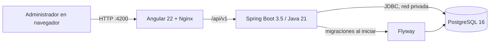

# Arquitectura de la Fase 1

## Objetivo

Producir una base ejecutable, reproducible y verificable para el CRM web Ruta
Fija. En esta fase se priorizan identidad, contexto de organización, auditoría,
migraciones y observabilidad mínima. Los módulos de negocio completos quedan
detrás de las puertas de las fases siguientes.

## Vista de contenedores

Solo los puertos enlazados a `127.0.0.1` se publican en el equipo. Dentro de
Compose, backend resuelve la base por el nombre de servicio `postgres`; no se
usan direcciones IP fijas. El volumen `postgres_data` conserva los datos entre
reinicios.

## Responsabilidades iniciales del backend

- `identity`: autenticación, JWT de acceso, rotación del refresh token, cierre
  de sesión y consulta de la identidad actual.
- `organization`: organización activa y límites multiempresa.
- `audit`: registro append-only de eventos de seguridad y administración.
- `shared`: errores normalizados, identificadores de correlación, utilidades y
  contratos transversales.

El aislamiento se aplica en el servidor y en cada consulta; ocultar opciones en
Angular no se considera una medida de autorización. Los identificadores
externos son UUID y las respuestas no deben revelar si un recurso pertenece a
otra organización.

El login limita el trabajo BCrypt mediante ventanas acotadas por cuenta
anonimizada y por instancia. Esta implementación en memoria es deliberadamente
local para la única instancia de Fase 1; antes de escalar horizontalmente deberá
sustituirse por un coordinador compartido. Los endpoints que usan la cookie de
renovación validan `Origin`/Fetch Metadata además de CORS y `SameSite=Strict`.

## Responsabilidades iniciales del frontend

- Login y sesión.
- Layout base y navegación protegida.
- Interceptor para credenciales/token y errores normalizados.
- Guards para sesión y permisos como apoyo de experiencia de usuario.
- Configuración de API en tiempo de ejecución, sin reconstruir la imagen.
- Renovación serializada entre pestañas mediante Web Locks y un lease efímero
  de respaldo que nunca contiene tokens.

## Perfiles y configuración

| Perfil | Base de datos | Semillas demo | Uso |
| --- | --- | --- | --- |
| `dev,docker` | PostgreSQL 16 de Compose | Sí, dos organizaciones | Demostración local |
| `test` | PostgreSQL 16 efímero/Testcontainers | No | Pruebas automatizadas |
| `prod` | PostgreSQL 16 configurado externamente | No | Futuro; fuera de Fase 1 |

Los secretos entran por variables de entorno. `.env.example` solo declara el
contrato y `.env` está ignorado por Git.
Backend y PostgreSQL operan en UTC; la conversión a `America/Lima` corresponde a
la preferencia de organización y a la interfaz, no al almacenamiento.

## Secuencia de arranque

1. PostgreSQL inicia y `pg_isready` confirma disponibilidad.
2. Backend inicia después de la base, Flyway valida/aplica migraciones y
   Actuator publica su health check.
3. Frontend inicia después de que el backend esté saludable y redirige `/api/`
   al servicio interno.

`depends_on` ordena y comprueba disponibilidad local, pero no reemplaza los
timeouts, reintentos y manejo de errores dentro de la aplicación.
Los reinicios automáticos se limitan a tres intentos para evitar ciclos que
oculten la causa de un fallo.

## Límites explícitos

- No hay aplicación móvil ni simulador móvil.
- No se integran correo, almacenamiento de objetos, FCM ni otros servicios
  externos.
- No se instala PostgreSQL en el host.
- No se certifica producción en esta fase.
- Mapa, ubicación en tiempo real, incidencias avanzadas y reportes funcionales
  pertenecen a fases posteriores y deben reevaluarse contra el alcance web.
